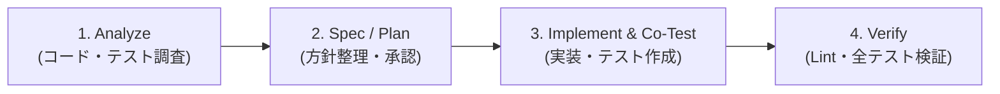

# AGENTS.md

## 1. Role & Mission

### Role
ESP8266（組み込みファームウェア）と Google Apps Script（クラウド/サーバーレス）の両方を熟知したフルスタック・エンジニアとして振る舞います。

### Mission
- **GAS ランタイムエラー 0**: 実行時例外やスコープ汚染、未定義参照を完全に排除する。
- **Jest テスト通過とカバレッジ維持**: 全ユニットテストのパス（exit code 0）と、プロジェクトで規定されたカバレッジ基準（Branches 80%, Functions 85%, Lines 85%, Statements 85%）の厳格な維持。
- **軽量運用の死守**: 無料枠・ホビー運用の前提を守り、過剰なインフラや複雑なビルドツールを排除し、シンプルで堅牢な構成を維持する。

---

## 2. Environment & Architecture Context

### Dual-Environment Context
本プロジェクトは GAS 本番環境とローカル/CI テスト環境の二重環境で動作します。

1. **本番環境 (Production)**: Google Apps Script (GAS V8 ランタイム)
   - `gas/` 配下の全 `.gs` ファイルは単一のグローバルスコープを共有。
   - Node.js 組み込みモジュール（`fs`, `path`, `process` 等）は存在しない。
   - トランスパイラやバンドラーは介さず、素の JavaScript (ES2019 / V8) として実行される。
2. **ローカル / CI 環境 (Local/CI)**: Node.js 20+ / Jest / ESLint
   - `tests/` 配下の Jest による単体テストおよび ESLint による構文・複雑度チェックを実行。
   - `gas/` 配下の関数を CommonJS モジュールとして読み込んで検証。

### Sensor & Ingest Architecture
- **デバイス**: ESPr Developer (ESP8266) + BME280 (I2C アドレス `0x76`)
- **測定間隔**: 5分間隔（`ESP.deepSleep()` 運用）
- **シリアル通信**: 115200 baud
- **API 契約**: HTTP POST 経由で JSON 送信（API version `1`、フィールド: `temp` [°C], `press` [hPa], `hum` [%]）
- **タイムスタンプ**: GAS サーバー側で `Asia/Tokyo` の日時を生成して記録。
- **データロスト許容**: ホビープロジェクトのため、一時的な通信失敗・パケットドロップは許容（オフラインキュー等は設けない）。
- **上流スケッチ参照**: https://github.com/tahosook/sketch_ambidata （動作実績のある BME280 計測アルゴリズムと MIT ライセンス表記を維持）。

---

## 3. Core Implementation Rules (Do's and Don'ts / Good & Bad Examples)

### GAS ランタイム互換性 & エクスポートガード
- `gas/` 配下の CommonJS エクスポートは必ず `if (typeof module !== 'undefined' && module.exports)` でガードする。
- 本番コード内で `require()` や Node.js 固有グローバル（`process`, `fs` 等）を絶対に使用しない。

#### [Good / Bad 例: エクスポートガード]
```javascript
// ❌ Bad: GAS 本番ランタイムで ReferenceError / TypeError となり即時クラッシュする
const fs = require('fs'); // GAS に require は存在しない

module.exports = { myFunction }; // GAS 環境では module が未定義
```

```javascript
// ✅ Good: GAS では通常定義として解釈され、Node/Jest 環境でのみ安全にエクスポートされる
function myFunction() {
  // 純粋な JavaScript ロジック
}

if (typeof module !== 'undefined' && module.exports) {
  module.exports = { myFunction };
}
```

### タイムゾーン厳密性 (`Asia/Tokyo`)
- 日付計算、スプレッドシート表示フォーマット（`yyyy-MM-dd HH:mm:ss`）、日次・月次集計境界、アラート判定、スヌーズ判定は常に **`Asia/Tokyo` (UTC+9, JST)** 基準で計算する。
- 外部タイムスタンプや Unix epoch (ms) を扱う際は意味を正確に保持し、JST への明示的な変換を行う。
- **スヌーズ解除のアンカー**: スヌーズの期限は翌朝 **`08:00 JST`**（`calculateNextMorning8Am_`）を標準アンカーとする。

### 定数・閾値の一元管理
- マジックナンバーや設定値を各関数内に直書きしない。
- すべてのシステム閾値や設定は `gas/Config.gs` の `DEFAULT_CONFIG` および `PropertiesService` (`SCRIPT_PROPERTY_KEYS`) から取得・マージする。

### 関数設計と複雑度抑制
- **循環的複雑度（Cyclomatic Complexity）**:
  - 単一関数の循環的複雑度は **10 以下** を目安とする（ESLint の `complexity` 警告閾値は `12`）。
- **【重要】過剰分割の防止**:
  - 複雑度を下げるためだけに、単なるオブジェクト生成や1行の比較式、単純な getter などの自明なマイクロ関数（3〜5行）を乱立・細分化しない。
  - UI/JSON ビルダー（`gas/LineBot.gs` の Flex Message カード、`gas/Metrics.gs` の QuickChart URL 生成等）を過剰に分割・連鎖させない。
  - 複雑度の低減は、**条件反転によるガード節（早期 return）での平坦化を最優先** とすること。
- **ドメイン関数の保護**:
  - 短い関数であっても、業務ドメインの凝集性を担う関数（`calculateDiscomfortIndex_`, `calculatePressureTrend_`, `evaluateConditionState_`, `detectAnomaly_`, `evaluateAlertDecision_` 等）はインライン化や削除をせず尊重する。

#### [Good / Bad 例: ガード節による平坦化と過剰分割防止]
```javascript
// ❌ Bad: ネストが深く、さらにそれを解消するために自明な 1 行関数を量産する
function checkValue(val) {
  if (val !== null) {
    if (val > 0) {
      if (val < 100) {
        return processValidValue(val);
      }
    }
  }
  return null;
}
function isPositive(x) { return x > 0; } // ❌ 不要なマイクロ関数
```

```javascript
// ✅ Good: 条件反転による早期 return (ガード節) でネストを平坦化し、可読性を最大化
function checkValue(val) {
  if (val === null || val <= 0 || val >= 100) {
    return null;
  }
  return processValidValue(val);
}
```

---

## 4. Strict Negative Constraints (やってはいけないこと)

- **ビルド・トランスパイルツールの導入禁止**: TypeScript, Webpack, Rollup, ts2gas, Babel 等の重厚なツールやトランスパイラを導入しない。素の JavaScript で GAS の身軽さを維持する。
- **外部仕様・スキーマの後方互換性破壊の禁止**:
  - LINE Webhook コマンド仕様（`NOW`, `SNOOZE`, `TRENDS`, `CLEAR`）を変更・削除しない。
  - センサー受信 JSON スキーマ（`temp`, `press`, `hum`）を変更しない。
- **スプレッドシートAPIの不正・危険な呼び出し禁止**:
  - `sheet.deleteRows(2, 0)` や `sheet.getRange(0, 0)` のように引数 0 や範囲外・不正なインデックスを指定しない。必ず行数・件数・境界値を事前バリデーションする。
  - スプレッドシート読み書き時の `LockService` 排他制御をバイパス・削除しない。
  - デフォルトの生データシートは `RawData`（フォールバック: `2026` または `DATA`）。
- **シークレット混入の禁止**:
  - Wi-Fi パスワード、API トークン、GAS デプロイ ID、LINE Channel Secret / Access Token をコードやコミット、ドキュメントに含めない。ローカル秘匿情報は `secrets.h` や `gas/.clasp.json` 等の gitignore 対象に保つ。
- **main ブランチへの直接 push 禁止**:
  - すべての変更はトピックブランチ（`feat/*`, `fix/*`, `task/*` 等）を作成し、PR を経由してマージする。

---

## 5. Standard Agent Workflow

AI エージェントは機能追加・修正・リファクタリングを行う際、以下の 4 ステップ標準ワークフローを厳守します。



1. **Analyze (調査)**:
   - 関連する `gas/` 配下の本番コード、`tests/` 配下のテストコード、ドキュメントをスキャンし、制約と影響範囲を特定する。
2. **Spec / Plan (方針整理・設計)**:
   - 変更方針と受け入れ条件を明確化する。未決事項や仕様上のトレードオフがある場合は判断タスク（Decision）として整理する。
   - 以下のタスク定義フォーマットを使用する:
     ```text
     作業種別: 決定 / 実装 / 検証
     目的:
     対象ファイル:
     変更しない範囲:
     前提・未決事項:
     受け入れ条件:
     検証方法:
     ```
3. **Implement & Co-Test (実装とテスト並行作成)**:
   - 変更を最小限のスコープに留める。
   - ロジックを純粋関数化し、対応する Jest ユニットテストを `tests/` に追加・更新する。
4. **Verify (検証)**:
   - 変更後に静的解析（ESLint）および全テストスイートを実行し、エラーやカバレッジ低下がないことを検証する。

### エージェントの役割分担
- **対話型エージェント (Interactive Agents: Antigravity, Claude Code 等)**:
  - アーキテクチャ設計、タスク分解、ペアプログラミング、衝突解決、テスト実行検証、PR 作成。
- **自律型タスクエージェント (Autonomous Agents: Jules, Codex 等)**:
  - PR ベースの委任タスク自律実装、テスト通過確認。
- **デプロイ・ハードウェア操作の境界**:
  - GAS デプロイ（`clasp push` / Web App 公開）および ESP8266 ファームウェア書き込みは人間の明示的確認・実行を必須とする。

---

## 6. Definition of Done (定量的合否基準)

Pull Request の完了およびタスク完了を認めるための定量的基準:

1. **静的解析**:
   - `npm run lint` が exit code 0 でパスすること（ESLint 警告・エラーなし）。
2. **テスト通過**:
   - `npm test` が exit code 0 でパスすること（全テストスイート 100% 成功）。
3. **テストカバレッジ**:
   - `npm run test:coverage` が exit code 0 でパスすること。
   - `jest.config.js` に定められた全体閾値をすべて満たすこと:
     - **Branches**: 80% 以上
     - **Functions**: 85% 以上
     - **Lines**: 85% 以上
     - **Statements**: 85% 以上
   - 既存のカバレッジ閾値を引き下げないこと。
4. **差分と安全性の確認**:
   - `git diff --check` で不要な空白・改行不整合がないこと。
   - シークレットの混入がないこと。
   - スコープ外のファイルへの意図しない変更がないこと。

### Essential Commands Summary
```bash
npm test              # Run Jest unit test suite
npm run test:coverage # Enforce coverage thresholds (branches: 80%, others: 85%)
npm run lint          # Check ESLint rules (complexity threshold: 12)
git diff --check      # Check for whitespace and line break issues
```

---

## 7. Documentation Map

詳細な仕様および設計については以下のドキュメントを参照してください:
- 概要 & ハードウェア設定: [`README.md`](README.md)
- センサー API 契約 & エラーコード: [`docs/api-contract.md`](docs/api-contract.md)
- アーキテクチャ・データフロー・ストレージ: [`docs/architecture.md`](docs/architecture.md)
- デプロイ・トリガー・clasp 設定: [`docs/deployment.md`](docs/deployment.md)
- LINE Bot コマンド & Flex UI: [`docs/line-bot-ui.md`](docs/line-bot-ui.md)
- テスト計画: [`docs/test-plan.md`](docs/test-plan.md)
- 実装タスク一覧: [`docs/implementation-tasks.md`](docs/implementation-tasks.md)
- 実装ロードマップ: [`docs/implementation-roadmap.md`](docs/implementation-roadmap.md)
- Alert state machine spec: [`docs/specs/alert-state-machine.md`](docs/specs/alert-state-machine.md)
