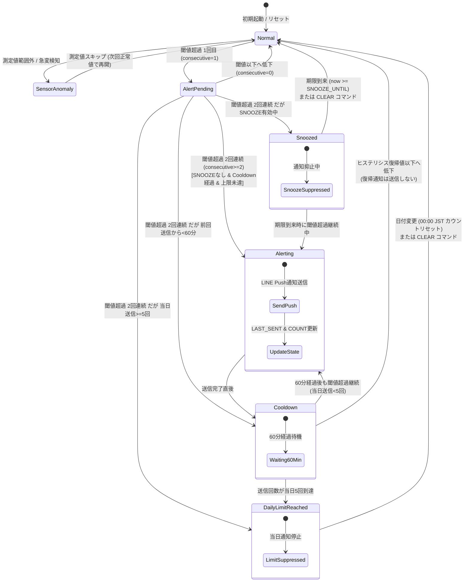
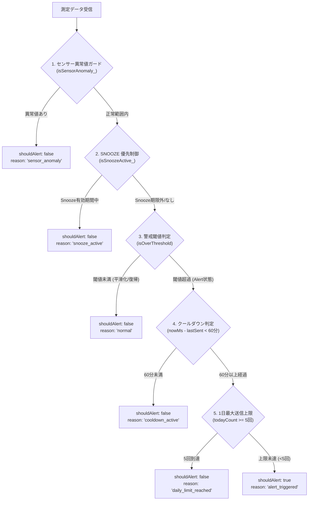

# 仕様書: アラート判定・状態遷移ステートマシン（Alert State Machine）

本仕様書は、`esp-bme280-gas-logger` における室温・湿度・不快指数の監視、アラート判定、および LINE プッシュ通知制御の正本（Single Source of Truth: SSOT）です。

---

## 1. Overview & Purpose

### 目的と設計方針
本システムは、LINE Messaging API の無料メッセージ枠（月間 200 通）を厳格に死守しながら、熱中症や住環境の悪化につながる環境異常（高温・高湿度・高不快指数）を確実に検知してユーザーに通知することを目的としています。

### 多層防御（Defense-in-Depth）アーキテクチャ
無料枠の浪費（メッセージ枯渇による重要通知の不達）や誤報（センサーノイズ、一時的なスパイク）を防ぐため、以下の多層防御機構を直列パイプラインとして配備しています:

1. **センサー異常値・スパイクガード**: 物理的にあり得ない外れ値（-10℃未満 / 50℃超など）や急変値を検知し、判定前に除外。
2. **平滑化（Smoothing, K=2）**: 閾値超過が 2 回連続（最短 10 分間）継続した場合にのみアラート状態へ移行（チャタリング防止）。
3. **ヒステリシス（Hysteresis）**: 発火閾値と復帰閾値に差を設け、境界値付近での頻繁な ON/OFF 繰り返しを防止。
4. **SNOOZE（通知停止）優先制御**: ユーザーが意図的に停止している期間（翌朝 08:00 JST 等）は閾値超過でも通知を抑止。
5. **1 時間クールダウン**: アラート状態が継続しても、前回到達時刻から 60 分間は再通知を抑制。
6. **1 日最大送信上限ガード**: 1 日（00:00〜23:59 JST）あたりの送信回数を最大 5 回に制限（緊急時のセーフティネット）。

---

## 2. State Transition Diagram (Mermaid)

システム内のアラートライフサイクルおよび状態遷移を以下に定義します。



### 状態定義一覧
| 状態名 | 概要 | 通知送信 | 次のトリガー |
| :--- | :--- | :--- | :--- |
| **Normal** | 正常監視状態。測定値は閾値未満または復帰基準を満たす。 | なし | 閾値超過、またはセンサー異常値 |
| **SensorAnomaly** | 測定値が範囲外（-10℃未満 / 50℃超、0%未満 / 100%超）または急変。 | なし | 測定値を破棄し直前有効値を維持 |
| **AlertPending** | 1 回目の閾値超過（平滑化 K=2 待機中）。 | なし | 2 回目超過で発火、または正常域へ低下でリセット |
| **Alerting** | 警戒発火状態。条件をすべて満たし LINE 通知を送信中。 | **あり (Push)** | 送信後直ちに Cooldown または DailyLimitReached へ移行 |
| **Cooldown** | 送信後 60 分間の待機状態。チャタリング通知を抑制。 | なし | 60分経過（再発火判定）またはヒステリシス復帰 |
| **Snoozed** | ユーザーによる停止指示中（翌朝 08:00 JST またはカスタム指定日時）。 | なし | スヌーズ期限満了または CLEAR コマンド |
| **DailyLimitReached** | 1 日の最大送信回数（5回）に到達。当日の通知を全停止。 | なし | 日付変更（00:00 JST）または CLEAR コマンド |

---

## 3. Evaluation Pipeline & Priority Rules

測定値受信時に実行される評価パイプライン（`gas/Metrics.gs: evaluateAlertDecision_`）は、**以下の厳格な優先順序（短絡評価）** で判定されます。



### パイプライン詳細ルール

#### 優先順位 1: センサー異常値ガード (`isSensorAnomaly_`)
- **判定条件**: 以下のいずれかに該当する場合は処理を即時中断:
  - `temp < -10.0` または `temp > 50.0`
  - `hum < 0.0` または `hum > 100.0`
  - `temp`, `hum` のいずれかが非数値 (`NaN`, `null`, `undefined`)
- **出力**: `{ shouldAlert: false, reason: 'sensor_anomaly' }`

#### 優先順位 2: SNOOZE 優先制御 (`isSnoozeActive_`)
- **判定条件**: `ALERT_SNOOZE_UNTIL` が設定されており、`nowMs < snoozeUntilMs` の場合。
- **出力**: `{ shouldAlert: false, reason: 'snooze_active' }`
- **備考**: LINE Bot からの「おやすみ / スキップ」コマンドにより、翌朝 08:00 JST（`calculateNextMorning8Am_`）またはカスタム日時がセットされる。

#### 優先順位 3: 警戒閾値・平滑化・ヒステリシス判定 (`isOverThreshold`)
`Monitor.gs` 内で各指標ごとに状態評価され、いずれか 1 つでも `alert === true` の場合に `isOverThreshold = true` となる。
- **平滑化 (Smoothing, consecutiveK = 2)**:
  - 測定値が上限閾値を超えた場合: `consecutive += 1`
  - 測定値が上限閾値以下の場合: `consecutive = 0`
  - `consecutive >= 2` で初めて `alert = true` へ昇格。
- **ヒステリシス閾値テーブル**:
  | 対象指標 | 発火閾値 (`over`) | 復帰閾値 (`over - hysteresis`) | 判定式 |
  | :--- | :--- | :--- | :--- |
  | **気温 (temp)** | `> 30.0 ℃` | `<= 29.5 ℃` (ヒステリシス 0.5℃) | 29.5℃超〜30.0℃以下は前状態を維持 |
  | **湿度 (hum)** | `> 70.0 %` | `<= 65.0 %` (ヒステリシス 5.0%) | 65.0%超〜70.0%以下は前状態を維持 |
  | **不快指数 (DI)** | `> 80.0` | `<= 79.5` (ヒステリシス 0.5) | 79.5超〜80.0以下は前状態を維持 |
- **不快指数計算式**:
  $$DI = 0.81 \times temp + 0.01 \times hum \times (0.99 \times temp - 14.3) + 46.3$$
- **出力**: `!isOverThreshold` の場合 `{ shouldAlert: false, reason: 'normal' }`

#### 優先順位 4: 1 時間クールダウン判定 (`ALERT_COOLDOWN_MIN = 60`)
- **判定条件**: `ALERT_LAST_SENT_TIME` が存在し、`(nowMs - lastSentTimeMs) < 60 * 60 * 1000` の場合。
- **出力**: `{ shouldAlert: false, reason: 'cooldown_active' }`

#### 優先順位 5: 1 日最大送信上限ガード (`ALERT_MAX_DAILY_COUNT = 5`)
- **判定条件**: `ALERT_COUNT_TODAY` の日付が当日（`todayJst: YYYY-MM-DD`）と一致し、かつ `count >= 5` の場合。
- **日付リセット**: 日付が昨日以前の場合はカウント 0 として評価（送信許可）。
- **出力**: `{ shouldAlert: false, reason: 'daily_limit_reached' }`

#### パイプライン通過: アラート発火 (`alert_triggered`)
- **出力**: `{ shouldAlert: true, reason: 'alert_triggered' }`
- **副作用**:
  - LINE Push 通知の送信 (`pushMonitorNotification_`)
  - `ALERT_LAST_SENT_TIME` に `nowMs` を記録
  - `ALERT_COUNT_TODAY` の `count` をインクリメント（日付更新時は 1 に設定）

---

## 4. Decision Table (決定表)

以下に、全条件の組み合わせと期待される判定結果・状態遷移を示します。

| No | センサー値 (Temp/Hum) | SNOOZE 有効 | 警戒状態 (isOverThreshold) | 経過時間 (lastSentTime) | 当日送信数 (todayCount) | shouldAlert | reason | 遷移後状態 |
| :---: | :---: | :---: | :---: | :---: | :---: | :---: | :--- | :--- |
| 1 | **異常** (51.0℃) | 任意 | 任意 | 任意 | 任意 | **false** | `sensor_anomaly` | SensorAnomaly |
| 2 | **異常** (-15.0℃) | 任意 | 任意 | 任意 | 任意 | **false** | `sensor_anomaly` | SensorAnomaly |
| 3 | **異常** (105%) | 任意 | 任意 | 任意 | 任意 | **false** | `sensor_anomaly` | SensorAnomaly |
| 4 | 正常 (31.0℃) | **有効中** | true | 任意 | 任意 | **false** | `snooze_active` | Snoozed |
| 5 | 正常 (25.0℃) | 無効/過去 | **false** (正常域) | 任意 | 任意 | **false** | `normal` | Normal |
| 6 | 正常 (31.0℃/1回目) | 無効/過去 | **false** (K=1未達) | 任意 | 任意 | **false** | `normal` | AlertPending |
| 7 | 正常 (29.8℃/発火後) | 無効/過去 | **true** (復帰未達) | < 60分 (30分前) | 1 | **false** | `cooldown_active` | Cooldown |
| 8 | 正常 (31.0℃/2回目) | 無効/過去 | **true** (発火) | < 60分 (45分前) | 2 | **false** | `cooldown_active` | Cooldown |
| 9 | 正常 (31.0℃/2回目) | 無効/過去 | **true** (発火) | >= 60分 (70分前) | **5 (上限到達)** | **false** | `daily_limit_reached` | DailyLimitReached |
| 10 | 正常 (31.0℃/2回目) | 無効/過去 | **true** (発火) | 未送信 (null) | 0 | **true** | `alert_triggered` | Alerting -> Cooldown |
| 11 | 正常 (31.0℃/2回目) | 無効/過去 | **true** (発火) | >= 60分 (65分前) | 1 (<5) | **true** | `alert_triggered` | Alerting -> Cooldown |
| 12 | 正常 (31.0℃/2回目) | 無効/過去 | **true** (発火) | >= 60分 (70分前) | 昨日 5回 / **本日 0回** | **true** | `alert_triggered` | Alerting -> Cooldown |
| 13 | 不正パラメータ (null) | 任意 | 任意 | 任意 | 任意 | **false** | `invalid_params` | - |

---

## 5. State Persistence Schema (PropertiesService)

システムの稼働状態は Google Apps Script の `PropertiesService.getScriptProperties()` に Key-Value 形式で永続化されます。

| プロパティ名 (`Key`) | 型 | 初期値 / デフォルト | 更新契機 | ライフサイクル / 備考 |
| :--- | :--- | :--- | :--- | :--- |
| `ALERT_SNOOZE_UNTIL`<br/>(旧: `MONITOR_SKIP_UNTIL`) | String (epoch ms) | なし (`null`) | LINE で `SNOOZE` コマンド受信時、または日時ピッカー操作時 | 期限到来で自然失効。`CLEAR` コマンドでキー削除。 |
| `ALERT_LAST_SENT_TIME` | String (epoch ms) | なし (`null`) | アラート Push 送信成功時 (`recordAlertNotification_`) | クールダウン（60分）経過計算に利用。永続保持。 |
| `ALERT_COUNT_TODAY` | String (JSON) | なし (`null`) | アラート Push 送信成功時 (`recordAlertNotification_`) | `{"date":"YYYY-MM-DD","count":N}` 形式。日付不一致時は自動リセット。 |
| `MONITOR_STATE_temp` | String (JSON) | `{"consecutive":0,"alert":false}` | 各測定値受信時 (`saveMonitorStates_`) | `{"consecutive":N,"alert":boolean}`。`CLEAR` コマンドで初期化。 |
| `MONITOR_STATE_hum` | String (JSON) | `{"consecutive":0,"alert":false}` | 各測定値受信時 (`saveMonitorStates_`) | 湿度監視状態。`CLEAR` コマンドで初期化。 |
| `MONITOR_STATE_discomfortIndex` | String (JSON) | `{"consecutive":0,"alert":false}` | 各測定値受信時 (`saveMonitorStates_`) | 不快指数監視状態。`CLEAR` コマンドで初期化。 |
| `MONITOR_LAST_VALID_payload` | String (JSON) | なし (`null`) | 正常測定値受信時 (`saveLastValidMeasurement_`) | 直前正常値キャッシュ（急変検知および status コマンド表示用）。 |
| `WATCHDOG_NOTIFIED` | String | なし (`null`) | 死活監視タイムアウト検知時 (`checkWatchdog`) | `'true'` を設定し重複通知抑止。新規測定データ受信でキー削除。 |

---

## 6. Traceability to Tests (`tests/alert.test.js`)

本仕様書に記載された仕様要件と、`tests/alert.test.js` における単体テストケースとの対応トレーサビリティマッピングです。

| 仕様セクション | 要件・境界値 | 対象テストケース（`describe` / `test`） |
| :--- | :--- | :--- |
| 3. 評価パイプライン | 正常域（閾値未満）判定 | `evaluateAlertDecision_` > `正常域（閾値未満）は shouldAlert: false, reason: "normal"` |
| 3. 優先順位 1 | センサー上限異常（気温 50.1℃） | `優先順位1: センサー異常値ガード` > `気温が上限（50℃）を超過した場合はスキップする` |
| 3. 優先順位 1 | センサー下限異常（気温 -10.1℃） | `優先順位1: センサー異常値ガード` > `気温が下限（-10℃）を下回った場合はスキップする` |
| 3. 優先順位 1 | 湿度上限異常（湿度 100.1%） | `優先順位1: センサー異常値ガード` > `湿度が上限（100%）を超過した場合はスキップする` |
| 3. 優先順位 1 | 湿度下限異常（湿度 -0.1%） | `優先順位1: センサー異常値ガード` > `湿度が下限（0%）を下回った場合はスキップする` |
| 3. 優先順位 2 | SNOOZE 期間中の無条件スキップ | `優先順位2: SNOOZE 優先制御` > `ALERT_SNOOZE_UNTIL 有効期間中は閾値超過時でも無条件にスキップする` |
| 3. 優先順位 2 | SNOOZE 期限切れ後のアラート許可 | `優先順位2: SNOOZE 優先制御` > `SNOOZE 期限が過去の場合はスヌーズ判定をパスする` |
| 3. 優先順位 3 | 60分未満のクールダウン抑止 | `優先順位3: 1時間クールダウン` > `前回送信から60分未満の場合はスキップする` |
| 3. 優先順位 3 | 60分経過後のアラート許可 | `優先順位3: 1時間クールダウン` > `前回送信から60分以上の場合はアラートを許可する` |
| 3. 優先順位 4 | 当日送信上限 5 回到達時の抑止 | `優先順位4: 1日最大送信上限` > `当日送信回数が上限（5回）に達した場合はスキップする` |
| 3. 優先順位 4 | 翌日日付変更時のカウントリセット | `優先順位4: 1日最大送信上限` > `日付が変更された場合は前日のカウントが5回でもリセットされ送信可能となる` |
| 2. 状態遷移 | 平滑化（K=2）によるチャタリング抑止 | `Monitor State Transitions & Hysteresis` > `平滑化（K=2）: 1回目の閾値超過ではアラートにならず、2回連続で超過するとアラート発火する` |
| 2. 状態遷移 | ヒステリシス復帰（29.5℃以下） | `Monitor State Transitions & Hysteresis` > `ヒステリシス判定: 30.0℃発火後、29.5℃以下になるまで通常状態に復帰しない` |
| 3. 閾値テーブル | 湿度・不快指数の発火と復帰 | `Monitor State Transitions & Hysteresis` > `湿度（HUM）および不快指数（DI）のアラート発報とヒステリシス復帰` |
| 1. 多層防御 | 急変検出（ΔTemp, ΔHum, ΔPress） | `Monitor State Transitions & Hysteresis` > `異常値検出（detectAnomaly_）: 気温・湿度・気圧の急変判定` |
| 2. 状態遷移 | 死活監視（3日間タイムアウト・抑止） | `Watchdog (死活監視)` > `3日以内のデータ受信時はタイムアウトせず通知しない` / `3日間未受信で初回の通知を発行` / `未受信継続中は再通知を抑制` |
| 5. 永続化 | 新規受信時の Watchdog/State リセット | `Watchdog (死活監視)` > `新規測定値の受信時に WATCHDOG_NOTIFIED およびモニター状態がリセットされる` |
| 5. 永続化 | 不正 JSON / null 引数の防御 | `Watchdog (死活監視)` > `Monitor: buildMonitorNotification_ および loadLastValidMeasurement_ の不正値ハンドリング` / `Metrics: evaluateAlertDecision_ の null 引数ハンドリング` |

---

## 7. Configuration Reference (`gas/Config.gs`)

本ステートマシンで参照される主な定数一覧です:

```javascript
const DEFAULT_CONFIG = {
  WATCHDOG_TIMEOUT_MIN: 4320,        // 3日間未受信で死活監視通知
  MONITOR_CONSECUTIVE_K: 2,          // 2回連続超過でアラート昇格
  MONITOR_TEMP_OVER: 30.0,           // 気温発火閾値 (℃)
  MONITOR_TEMP_HYSTERESIS: 0.5,      // 気温復帰ヒステリシス (復帰: 29.5℃)
  MONITOR_HUM_OVER: 70.0,            // 湿度発火閾値 (%)
  MONITOR_HUM_HYSTERESIS: 5.0,       // 湿度復帰ヒステリシス (復帰: 65.0%)
  MONITOR_DI_OVER: 80.0,             // 不快指数発火閾値
  MONITOR_DI_HYSTERESIS: 0.5,        // 不快指数復帰ヒステリシス (復帰: 79.5)
  ALERT_COOLDOWN_MIN: 60,            // 1時間クールダウン (分)
  ALERT_MAX_DAILY_COUNT: 5,          // 1日最大送信数 (回)
  SENSOR_GUARD_MIN_TEMP: -10.0,      // 気温ガード下限 (℃)
  SENSOR_GUARD_MAX_TEMP: 50.0,       // 気温ガード上限 (℃)
  SENSOR_GUARD_MIN_HUM: 0.0,         // 湿度ガード下限 (%)
  SENSOR_GUARD_MAX_HUM: 100.0,       // 湿度ガード上限 (%)
  SKIP_UNTIL_HOUR: 8                 // スヌーズ標準解除時刻 (08:00 JST)
};
```
