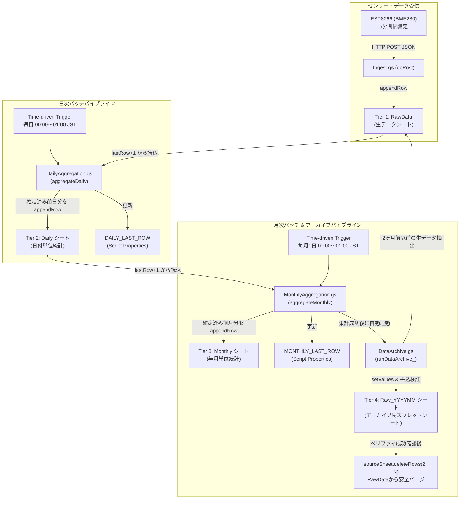
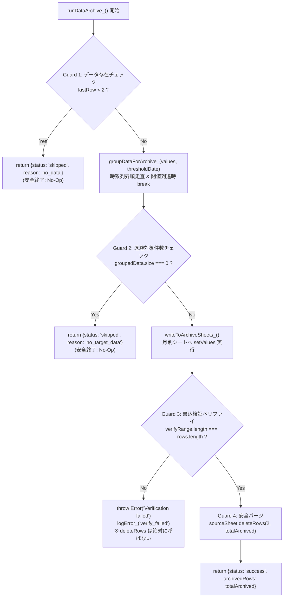
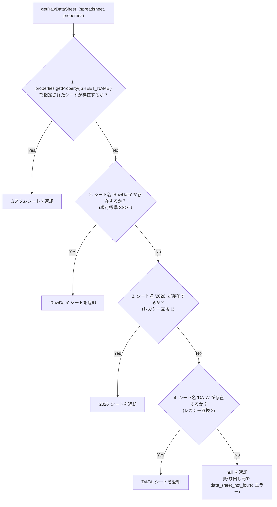

# 仕様書: データライフサイクルおよび集計・アーカイブ（Data Lifecycle & Aggregation）

本仕様書は、`esp-bme280-gas-logger` における生データ収集（RawData）、日次統計集計（Daily）、月次統計集計（Monthly）、および長期保管データの自動退避・パージ（DataArchive）に関するデータ管理仕様の正本（Single Source of Truth: SSOT）です。

---

## 1. Overview & Storage Lifecycle

### 目的と設計方針
Google スプレッドシートにはセル数上限（最大 1,000 万セル）が存在し、また Google Apps Script（GAS）には 1 回の実行時間上限（無料アカウントで 6 分間）が定められています。
ESP8266 から 5 分間隔で送信される環境センサーデータ（気温・湿度・気圧等）を単一シートに蓄積し続けると、以下の運用リスクが生じます:
1. **行数肥大化によるレイテンシ悪化**: データ取得（`getLastRow`, `getRange`）のオーバーヘッドが増大し、Web API（Ingest / Webhook）応答遅延を招く。
2. **GAS 実行タイムアウト**: LINE Bot の 24 時間トレンド描画（QuickChart 生成）や集計処理が 6 分を超過してクラッシュする。
3. **容量制限到達による停止**: セル数上限に達し、生データ記録が不可となる。

本システムではこれらを恒久的に回避するため、**直近 1〜2 ヶ月の高速アクセス用生データ**、**日次統計**、**月次統計**、**長期保管用アーカイブ**の 4 層データライフサイクル構造を採用しています。

### 多層ストレージ階層（Storage Tiers）

| 階層 | シート名 | 保持期間 | レコード件数目安 | 用途 |
| :--- | :--- | :--- | :--- | :--- |
| **Tier 1: 生データ** | `RawData` (フォールバック: `2026`, `DATA`) | 直近 1〜2 ヶ月分 （`ARCHIVE_RETENTION_MONTHS = 2`） | 約 8,640 行/月 （最大約 17,000 行） | 直近のリアルタイム監視、LINE Bot `NOW`/`TRENDS` コマンド応答、日次集計元データ |
| **Tier 2: 日次要約** | `Daily` | 永続（長期） | 365 行/年 | 日次統計（平均・最小・最大・サンプル数・アラート数）、月次集計元データ |
| **Tier 3: 月次要約** | `Monthly` | 永続（半永久） | 12 行/年 | 年間・経年変化分析、月次レポート用要約統計 |
| **Tier 4: アーカイブ** | `Raw_YYYYMM` （例: `Raw_202606`） | 永続（別ブック推奨） | 約 8,640 行/シート/月 | 2 ヶ月前の確定済み生データの退避先（`RawData` からパージ） |

### データライフサイクルのフロー図

---

## 2. Daily Aggregation Pipeline (`Daily` シート)

### トリガー契機と排他制御
- **トリガー**: 時間主導型トリガー（Time-driven Trigger）、毎日 00:00〜01:00 JST に `aggregateDaily()` を実行。
- **排他制御**: `LockService.getScriptLock()` を使用し、最大 15 秒間（`DAILY_LOCK_TIMEOUT_MS = 15000` または `INGEST_LOCK_TIMEOUT_MS`）排他ロックを取得。Ingest 処理や他の定期処理との書き込み競合を防止する。
- **異常時リカバリ**: 例外発生時は `DAILY_LAST_ROW` を更新せず、`finally` 句で確実に `lock.releaseLock()` を呼ぶ。次回のトリガー実行時に安全に再試行される。

### 差分走査アルゴリズムと JST 境界条件
1. `PropertiesService.getScriptProperties()` より `DAILY_LAST_ROW` を取得（初期値または未設定時は `1` 行目＝ヘッダー行）。
2. `dataSheet.getLastRow()` が `lastProcessedRow` 以下の場合は、新規レコードなしとして早期リターン（`processedDays: 0, appendedDays: 0`）。
3. 対象範囲（`startRow = lastProcessedRow + 1` から `totalDataRows` まで）のデータを 5 列（`timestamp, temp, press, hum, flag`）取得。
4. **【重要】当日未確定データの走査打ち切り**:
   - レコードのタイムスタンプを JST (`Asia/Tokyo`) の `yyyy-MM-dd` に変換。
   - `rowDateStr >= todayStr`（当日以降）に達した時点で走査ループを `break` して即時中断。
   - 当日進行中のデータは集計せず、前日以前の「丸 1 日確定済みデータ」のみを集計対象とする。

### Daily 出力スキーマ（12 カラム）
`Daily` シートのヘッダーおよびデータ行の定義は以下の通りです:

| 列インデックス | カラム名 | 型 | 算出ロジック・丸め規則 |
| :--- | :--- | :--- | :--- |
| 1 | `日付` | string (`yyyy-MM-dd`) | JST 基準の年月日 |
| 2 | `temp_avg` | number | 有効気温サンプルの算術平均（小数第 2 位四捨五入: `roundTwoDecimals_`） |
| 3 | `temp_min` | number | 有効気温サンプルの最小値（`Math.min`） |
| 4 | `temp_max` | number | 有効気温サンプルの最大値（`Math.max`） |
| 5 | `hum_avg` | number | 有効湿度サンプルの算術平均（小数第 2 位四捨五入） |
| 6 | `hum_min` | number | 有効湿度サンプルの最小値（`Math.min`） |
| 7 | `hum_max` | number | 有効湿度サンプルの最大値（`Math.max`） |
| 8 | `press_avg` | number | 有効気圧サンプルの算術平均（小数第 2 位四捨五入） |
| 9 | `press_min` | number | 有効気圧サンプルの最小値（`Math.min`） |
| 10 | `press_max` | number | 有効気圧サンプルの最大値（`Math.max`） |
| 11 | `sample_count` | number (integer) | 統計計算に算入された有効サンプル件数（正常測定値数） |
| 12 | `alert_count` | number (integer) | `flag === 'alert'` が付与されたレコード件数 |

### 異常値除外・フラグハンドリング・欠損耐性
- **`flag === 'anomaly'` 行の扱い**:
  - センサー断線・通信不良等による異常値フラグ行は、**`sample_count`、平均・最小・最大の全統計から完全に除外**する。
- **`flag === 'alert'` 行の扱い**:
  - `bucket.alertCount += 1` を加算。
  - 温湿度・気圧値自体が有限の数値（`typeof val === 'number' && isFinite(val)`）であれば、統計値および `sample_count` に算入する。
- **欠損値・不正値のスキップ**:
  - `timestamp` が存在しない行、文字列、`NaN`、`null` が含まれるカラムはスキップし、計算エラーを防止。
- **サンプリング不足・全欠損時のゼロ埋め防止**:
  - 通信途絶等により 1 日の有効サンプル数が 0 件（`sampleCount === 0`）となった日付は、`buildDailyRowData_` が `null` を返却し、`Daily` シートへの追記を行わない（存在しないゼロ値でのデータ汚染を防止）。
- **冪等性の担保（二重集計防止）**:
  - 集計処理前に `getExistingDailyDates_` で `Daily` シートの既存日付一覧を `Set` として取得。
  - 既に登録済みの `dateStr` は `continue` でスキップし、再実行時の重複追記を防止。

---

## 3. Monthly Aggregation Pipeline (`Monthly` シート)

### トリガー契機と排他制御
- **トリガー**: 時間主導型トリガー、毎月 1 日 00:00〜01:00 JST に `aggregateMonthly()` を実行。
- **排他制御**: `LockService.getScriptLock()` を使用し、最大 15 秒間（`MONTHLY_LOCK_TIMEOUT_MS = 15000`）排他ロックを取得。
- **後続処理の連動**: 月次集計が完了した直後に、自動的に `runDataArchive_()`（データ退避パイプライン）を呼び出す。アーカイブ処理でエラーが発生した場合でも、エラーログ（`archive_failed`）を記録した上で月次集計自体の結果を正常返却する。

### 差分走査アルゴリズムと JST 境界条件
1. `PropertiesService.getScriptProperties()` より `MONTHLY_LAST_ROW` を取得（初期値 `1`）。
2. `dailySheet.getLastRow()` が `lastProcessedRow` 以下の場合は、新規日次データなしとして早期リターン。
3. 対象範囲（`startRow = lastProcessedRow + 1` から `totalDailyRows` まで）のデータを 12 列取得。
4. **【重要】当月未確定データの走査打ち切り**:
   - 日付を JST の `yyyy-MM` に変換。
   - `rowYearMonth >= currentYearMonth`（当月進行中）に達した時点で走査ループを `break` して即時中断。
   - 前月末日までの確定月のみを月次集計の対象とする。

### Monthly 出力スキーマ（11 カラム）
`Monthly` シートのヘッダーおよびデータ行の定義は以下の通りです:

| 列インデックス | カラム名 | 型 | 算出ロジック・丸め規則 |
| :--- | :--- | :--- | :--- |
| 1 | `年月` | string (`yyyy-MM`) | JST 基準の年月 |
| 2 | `temp_avg` | number | 日次平均気温（`Daily` 列 2）の算術平均（小数第 2 位四捨五入） |
| 3 | `temp_min` | number | 日次最低気温（`Daily` 列 3）の中の最小値（`Math.min`） |
| 4 | `temp_max` | number | 日次最高気温（`Daily` 列 4）の中の最大値（`Math.max`） |
| 5 | `hum_avg` | number | 日次平均湿度（`Daily` 列 5）の算術平均（小数第 2 位四捨五入） |
| 6 | `hum_min` | number | 日次最低湿度（`Daily` 列 6）の中の最小値（`Math.min`） |
| 7 | `hum_max` | number | 日次最高湿度（`Daily` 列 7）の中の最大値（`Math.max`） |
| 8 | `press_avg` | number | 日次平均気圧（`Daily` 列 8）の算術平均（小数第 2 位四捨五入） |
| 9 | `press_min` | number | 日次最低気圧（`Daily` 列 9）の中の最小値（`Math.min`） |
| 10 | `press_max` | number | 日次最高気圧（`Daily` 列 10）の中の最大値（`Math.max`） |
| 11 | `days_count` | number (integer) | 集計に算入された有効日数 |

### 境界値・年跨ぎ・カレンダー整合性
- **年跨ぎ（Year Rollover）**:
  - 毎年 1 月 1 日の実行時において、前年 12 月（`YYYY-12`）のデータが正確に集計され、`Monthly` シートに追記される。
- **うるう年（Leap Year）の整合性**:
  - 2 月の日数判定において、うるう年（例: 2024 年 2 月 = 29 日）および平年（例: 2026 年 2 月 = 28 日）の日数および統計値が正確に算出・検証される。
- **日次行バリデーション**:
  - `isValidMonthlyRow_` により、列 1〜9（気温・湿度・気圧の統計値）がすべて有限の数値である行のみをバケットに蓄積。
- **冪等性**:
  - `getExistingMonthlyDates_` により既に存在する `yyyy-MM` は重複追記されない。

---

## 4. Data Archiving & Purging Pipeline (`DataArchive.gs`)

### 保管期間と閾値日時計算ロジック
- **保持期間設定**: `config.ARCHIVE_RETENTION_MONTHS`（デフォルト `2` ヶ月）。
- **閾値計算（`getArchiveThresholdDate_`）**:
  - 実行時 JST 日時（`now`）を取得。
  - 現在月から `retentionMonths - 1` ヶ月減算（例: `retentionMonths = 2` の場合、1 ヶ月前の 1 日 00:00:00 JST が基準境界）。
  - 月減算により月が 0 未満となった場合は、年を 1 減算し月を 12 加算（年跨ぎ減算の安全処理）。
  - 返却値: `Date.UTC(year, month, 1, -9, 0, 0, 0)`（`year-month-01 00:00:00 JST` に相当する UTC Date オブジェクト）。
  - **具体例**:
    - 2026 年 9 月 1 日 01:00 JST 実行時 → 閾値は **2026 年 8 月 1 日 00:00:00 JST**。
    - 2026 年 7 月 31 日 23:59:59 JST 以前のデータ（すなわち 2 ヶ月前である 7 月以前のデータ）がすべて退避対象となる。

### アーカイブ先スプレッドシートの決定
1. `PropertiesService.getScriptProperties()` から `ARCHIVE_SPREADSHEET_ID`（キー: `SCRIPT_PROPERTY_KEYS.archiveSpreadsheetId`）を取得。
2. 設定されていない場合、またはメインシートと同一 ID の場合は、同一スプレッドシートファイル（`SPREADSHEET_ID`）内にアーカイブシートを作成してフォールバック退避する。

### 退避先シート命名規則と初期化
- **シート名規則**: `'Raw_' + yearMonth.replace('-', '')`（例: `2026-06` → `Raw_202606`）。
- **初期化**:
  - 退避先シートが存在しない場合、`archiveSpreadsheet.insertSheet(targetSheetName)` を呼び出して新規作成。
  - ヘッダー行 `['timestamp', 'temp', 'press', 'hum', 'flag']` を自動追記。

### トランザクション安全ガード（最重要制約）

生データの欠落やスプレッドシート API エラーによる処理停止を防ぐため、以下の 4 重の安全ガードを設けています:

1. **Guard 1: 0 件ガード（データなしスキップ）**:
   - `sourceSheet.getLastRow() < 2` の場合は即時 `{ status: 'skipped', reason: 'no_data' }` を返し、API 操作を一切行わない。
2. **Guard 2: 対象 0 件ガード（`deleteRows(2, 0)` の絶対禁止）**:
   - 閾値日より古いデータが存在しない（`groupedData.size === 0`）場合、即時 `{ status: 'skipped', reason: 'no_target_data' }` を返す。
   - 引数 0 での `deleteRows(2, 0)` 呼び出しを完全に防止する（Google Sheets API 例外の抑止）。
3. **Guard 3: 書込検証（ベリファイ）**:
   - 退避先シートへ `setValues(rows)` を実行した直後、`targetSheet.getRange(startRow, 1, rows.length, 1).getValues()` により書き込み済み行数を再取得。
   - `verifyRange.length !== rows.length` の場合は例外を throw し、元シートの `deleteRows` を絶対に実行しない。
4. **Guard 4: 複数月バックログの一括分割処理**:
   - システム停止やメンテナンス等で複数月（例: 5 月分と 6 月分）の生データが滞留している場合、`groupDataForArchive_` が `Map<yearMonth, rows>` として月別にグループ化。
   - `Raw_202605`、`Raw_202606` それぞれのシートに順番に書き込み・検証を実施した上で、最後に退避した合計行数（`totalArchived`）分だけ元シート先頭から一括削除する。

---

## 5. Sheet Name Resolution & Backward Compatibility

### 生データシート名の解決優先順位（`getRawDataSheet_`）
本リポジトリでは生データシートの正本名を `RawData` と規定していますが、過去の運用バージョンやカスタム設定との互換性を保つため、[`gas/Config.gs`](file:///Users/tahosook/Documents/codex/esp-bme280-gas-logger/gas/Config.gs#L141-L159) の `getRawDataSheet_` において以下の優先度で探索・解決します:

1. **第 1 優先**: `PropertiesService` の `SHEET_NAME` プロパティ（ユーザーによる明示的設定）。
2. **第 2 優先**: `RawData`（現在のプロジェクト標準・正本シート名）。
3. **第 3 優先**: `2026`（年別運用時のレガシーシート名）。
4. **第 4 優先**: `DATA`（初期プロトタイプ時のレガシーシート名）。
5. **未検出時**: `null` を返却。各モジュール（`DailyAggregation`, `MonthlyAggregation`, `DataArchive`）は `data_sheet_not_found` または `sheet_not_found` のエラーコードでログを記録し、安全に例外を throw する。

### 集計・アーカイブシート名規約
- **日次集計シート**: `Daily`（固定）
- **月次集計シート**: `Monthly`（固定）
- **アーカイブシート**: `Raw_YYYYMM`（固定プレフィックス＋ハイフンなし年月 6 桁）

---

## 6. Traceability to Tests

本仕様書の各要件・アルゴリズム・境界値ガードは、以下の単体テストスイートによって 100% 検証されています。

### 日次集計テストトレーサビリティ ([`tests/aggregation.test.js`](file:///Users/tahosook/Documents/codex/esp-bme280-gas-logger/tests/aggregation.test.js))

| 仕様項目・要件 | 対象コード / 述語 | テストケース名 |
| :--- | :--- | :--- |
| 288 行フル集計・全カラム算出 | `aggregateDaily`, `buildDailyRowData_` | `288行フルデータから正しく avg / min / max / sample_count / alert_count を算出する` |
| anomaly 除外 & alert カウント | `accumulateDailyRow_` | `anomaly フラグ行は集計から除外され、alert フラグ行はカウントされる` |
| 欠損・不正値スキップ | `accumulateDailyRow_` | `欠損データや不正値（文字列・NaN・null）が混在してもクラッシュせず安全にスキップする` |
| 有効サンプル 0 件のゼロ埋め防止 | `buildDailyRowData_` | `有効サンプルが0件の日（全行異常値・不正値）はDailyシートへ追記されない（ゼロ埋め防止）` |
| 登録済み日付の二重集計防止（冪等性） | `getExistingDailyDates_`, `appendDailyDataRows_` | `既にDailyシートに存在する日付は二重登録されない（冪等性の担保）` |
| シート追記エラー時ロールバック & ロック解放 | `runDailyAggregation_` | `シート追記エラー発生時に DAILY_LAST_ROW は更新されず、ロックは解放される` |
| 未処理行なし時の早期リターン | `runDailyAggregation_` | `未処理の新規行が存在しない場合は安全に早期リターンする` |

### 月次集計テストトレーサビリティ ([`tests/aggregation.test.js`](file:///Users/tahosook/Documents/codex/esp-bme280-gas-logger/tests/aggregation.test.js))

| 仕様項目・要件 | 対象コード / 述語 | テストケース名 |
| :--- | :--- | :--- |
| 月次統計（avg/min/max/days_count）算出 | `aggregateMonthly`, `buildMonthlyRowData_` | `日次サマリー配列から月次統計（avg/min/max/days_count）を正しく算出する` |
| うるう年（2/29）および平年（2/28）整合性 | `processMonthlyDataRows_` | `うるう年（2月29日）および非うるう年（2月28日）の日数整合性を検証する` |
| 登録済み年月の重複防止（冪等性） | `getExistingMonthlyDates_` | `既にMonthlyシートに存在する年月は二重登録されない（冪等性の担保）` |
| 月途中中断・マルチステージ集計 | `processMonthlyDataRows_` | `月途中の中断・マルチステージ実行（月途中データが翌月に持ち越されて集計されること）` |
| 追記エラー時ロールバック & ロック解放 | `runMonthlyAggregation_` | `追記エラー発生時に MONTHLY_LAST_ROW は更新されず、ロックは解放される` |
| 設定不足・シート未検出時の例外 & ログ | `getMonthlyAggregationSheets_` | `設定不足・シート未検出時の例外スローとエラーログ記録` |
| JST 日時フォーマット・フォールバック | `formatDateTokyo_`, `formatYearMonthTokyo_` | `formatDateTokyo_ の各フォーマットおよび不正値処理` / `Utilities 未定義フォールバック分岐` |
| 負数ポインタ・空配列の安全処理 | `calcAvg_`, `buildMonthlyRowData_` | `calcAvg_ の空配列処理` / `MONTHLY_LAST_ROW が負数または未処理行なしの場合の安全な終了` |

### データ退避・パージテストトレーサビリティ ([`tests/archive.test.js`](file:///Users/tahosook/Documents/codex/esp-bme280-gas-logger/tests/archive.test.js))

| 仕様項目・要件 | 対象コード / 述語 | テストケース名 |
| :--- | :--- | :--- |
| 基準日計算（通常月） | `getArchiveThresholdDate_` | `should correctly calculate threshold date for standard months` |
| 基準日計算（年跨ぎ境界） | `getArchiveThresholdDate_` | `should handle year rollover correctly` |
| 閾値境界判定 & 早期走査終了 | `groupDataForArchive_` | `should group correctly and stop when reaching threshold` |
| 不正日付・文字列スキップ | `groupDataForArchive_` | `should handle string dates and skip invalid dates` |
| 正常退避・ベリファイ・パージ | `runDataArchive_`, `writeToArchiveSheets_` | `should archive and purge correctly` |
| 設定不足時の例外送出 | `getArchiveSpreadsheets_` | `should throw if spreadsheet ID is missing` |
| ソースシート未検出時の例外送出 | `getArchiveSpreadsheets_` | `should throw if source sheet is missing` |
| 0 件ガード（データ行なしスキップ） | `runDataArchive_` | `should skip if lastRow < 2` |
| 書込検証（ベリファイ）失敗時の削除防止 | `writeToArchiveSheets_` | `should throw if verification fails` |
| `ARCHIVE_SPREADSHEET_ID` 未設定フォールバック | `getArchiveSpreadsheets_` | `should fallback to spreadsheetId if ARCHIVE_SPREADSHEET_ID is missing` |
| 対象データ 0 件時の安全終了（No-Op） | `runDataArchive_` | `should skip if groupedData has size 0` |
