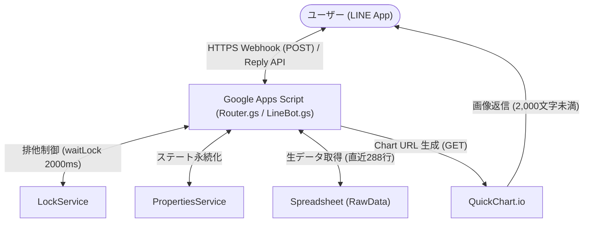
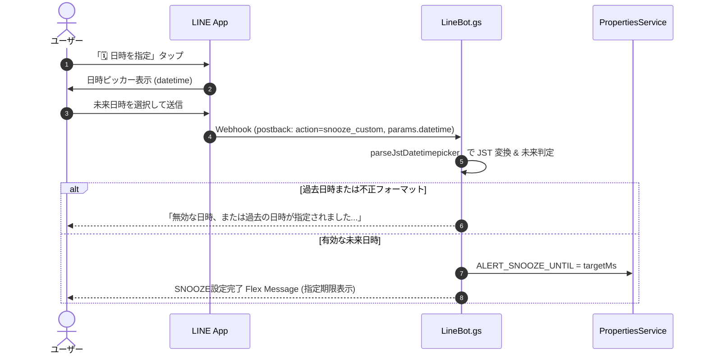

# 仕様書: LINE Webhook 応答および UI 契約（LINE Webhook Contracts & UI Specifications）

本仕様書は、`esp-bme280-gas-logger` における LINE Messaging API Webhook 応答、対話型 Flex Message UI、および QuickChart 連携機能の正本（Single Source of Truth: SSOT）です。

---

## 1. Overview & Architecture

### 全体アーキテクチャ
ユーザーとシステムの対話インターフェースとして LINE Bot を運用し、測定データのオンデマンド照会、通知停止（スヌーズ）、24時間推移グラフの確認を提供します。



### 署名検証とセキュリティ
1. **HMAC-SHA256 署名検証**:
   - HTTP リクエストヘッダー（またはクエリパラメータ）の `X-Line-Signature` を抽出。
   - `LINE_CHANNEL_SECRET` を鍵としてリクエストボディの HMAC-SHA256 ダイジェストを計算し、Base64 文字列を照合。
   - 署名不一致時は `{ ok: false, error: 'invalid_signature' }` を返却し、後続処理を拒絶。
2. **排他制御（LockService）**:
   - スヌーズ設定（`SNOOZE`, `snooze_custom`）およびリセット（`CLEAR`）時は、`LockService.getScriptLock()` により最大 `2000ms`（`LINE_LOCK_TIMEOUT_MS`）の排他ロックを獲得して状態の競合を防止。

---

## 2. Inbound Command Normalization Table (受信コマンド契約)

ユーザーから送信されたテキストメッセージは、`normalizeText_` により前処理された後、`dispatchTextMessageCommand_` でルーティングされます。

### テキスト正規化アルゴリズム (`normalizeText_`)
1. **Trim**: 前後の空白文字を除去。
2. **全角英数変換**: 全角英数字（`[Ａ-Ｚａ-ｚ０-９]`）を半角コードへ変換（文字コード差分 `0xFEE0` の減算）。
3. **小文字化**: `toLowerCase()` でアルファベットをすべて小文字化。

### コマンドエイリアス対応表
| 正準コマンド | 認識エイリアス（小文字/半角正規化後） | 返信形式 | 実行処理・作用 |
| :--- | :--- | :--- | :--- |
| **`NOW`** | `now`, `状況`, `状態`, `現在`, `status` | **Flex Message** (バブル) | 現在の監視状態・最新測定値カード（`buildStatusFlexMessage_`）を返信。 |
| **`SNOOZE`** | `snooze`, `スキップ`, `おやすみ`, `skip` | **Flex Message** (kilo) | 翌朝 08:00 JST までアラート Push を停止。`ALERT_SNOOZE_UNTIL` を更新し、設定完了カード（`buildSkipFlexMessage_`）を返信。 |
| **`TRENDS`** | `trends`, `グラフ`, `24h`, `推移` | **Image Message** | 直近 24 時間の温湿度推移グラフ画像（QuickChart URL）を返信（データ不足時はテキスト返信）。 |
| **`CLEAR`** | `clear`, `クリア`, `解除` | **Text Message** | スヌーズ設定を解除し、モニター状態（consecutive, alert）をリセットして通常監視を再開。 |
| **その他 (未定義)** | 上記以外のテキスト | **Text Message** | 利用可能コマンド一覧のヘルプメッセージを返信。 |

---

## 3. Postback Event Handling (`action=snooze_custom`)

SNOOZE 完了カードの「日時を指定」ボタンにより起動される LINE 標準 `datetimepicker` のイベント処理仕様です。



### パース及びバリデーション仕様 (`parseJstDatetimepicker_`)
1. **入力形式**: `YYYY-MM-DDTHH:mm` (正規表現: `/^(\d{4})-(\d{2})-(\d{2})T(\d{2}):(\d{2})$/`)
2. **JST タイムゾーン解釈**:
   - `Date.UTC(year, month, day, hour, min, 0, 0)` から JST オフセット `9 * 60 * 60 * 1000` (ms) を減算して、真の UTC epoch ミリ秒を算出。
3. **過去日時判定**:
   - `targetMs <= nowMs` の場合、`null` を返却。
   - ハンドラー側で `replyMessage_(replyToken, '無効な日時、または過去の日時が指定されました。未来の日時を指定してください。')` を送信し、プロパティ更新を中止。
4. **プロパティ保存**:
   - `ALERT_SNOOZE_UNTIL`（および後方互換 `MONITOR_SKIP_UNTIL`）に `String(targetMs)` を記録。

---

## 4. Flex Message Component Specifications

### 4.1 NOW カード (`buildStatusFlexMessage_`)
現在の環境測定値とシステムの監視稼働状態を一元表示する対話型カードです。

#### 画面構成と動的切替ルール
```text
┌──────────────────────────────────────────────┐
│ [Header]                                     │
│  🔔 監視中（Active）        [緑: #27ae60]     │
│  （SNOOZE時は「🔕 SNOOZE中」 [橙: #e67e22]）    │
├──────────────────────────────────────────────┤
│ [Body]                                       │
│  室温      26.5 ℃ (正常)                    │
│  湿度      55 % (正常)                       │
│  気圧      1012.3 hPa (安定)                 │
│  ────────────────────────────────────────── │
│  快適度    74.0（快適）                      │
│  ────────────────────────────────────────── │
│  計測日時  08/31 14:00 測定                  │
├──────────────────────────────────────────────┤
│ [Footer]                                     │
│  通常時:   [ 🔕 翌朝までSNOOZE ]  [ 📈 TRENDS ]│
│  SNOOZE時: [ 🔔 監視を再開（CLEAR） ]          │
└──────────────────────────────────────────────┘
```

- **ヘッダー切替**:
  - 通常監視中: 背景色 `#27ae60`、タイトル `🔔 監視中（Active）`
  - SNOOZE中: 背景色 `#e67e22`、タイトル `🔕 SNOOZE中`、サブタイトル `停止期限: MM/dd HH:mm まで (翌朝自動再開)`
- **表示項目と装飾仕様**:
  - **室温**: 警戒超過時は赤色 `#e74c3c` で `XX.X ℃ (⚠️ 超過)`、正常時は `#111111` で `XX.X ℃ (正常)`
  - **湿度**: 警戒多湿時は赤色 `#e74c3c` で `XX % (⚠️ 多湿)`、正常時は `#111111` で `XX % (正常)`（四捨五入整数表示）
  - **気圧**: `XX.X hPa (傾向)`。3時間前気圧との差分 $\Delta P$ により `↘ -2.1/3h` ($\le -1.0$), `↗ +1.5/3h` ($\ge +1.0$), `安定` ($|\Delta P| \le 0.2$), `→ +0.4/3h` (その他)
  - **快適度 (不快指数 DI)**: `XX.X（状態ラベル）`。80以上: 暑くてたまらない (`#e74c3c`), 75以上: やや暑い (`#e67e22`), 60未満: 肌寒い (`#3498db`), その他: 快適 (`#27ae60`)
  - **【最重要制約】容積絶対湿度は完全削除されていること**（UI・計算・ペイロードいずれにも含めない）
- **フッターボタン切替**:
  - 通常監視中: `🔕 翌朝までSNOOZE` (primary, `#f39c12`, text: `SNOOZE`), `📈 TRENDS` (secondary, text: `TRENDS`)
  - SNOOZE中: `🔔 監視を再開（CLEAR）` (primary, `#3498db`, text: `CLEAR`)

---

### 4.2 SNOOZE 完了カード (`buildSkipFlexMessage_`)
スヌーズ実行時に返信される確認カードです。

- **バブルサイズ**: `kilo`
- **主要コンテンツ**:
  - タイトル: `🔕 通知を停止しました` (太字, `#d97706`)
  - 期限表示: `期限: MM/dd HH:mm まで` (`#888888`)
- **アクションボタン**:
  1. `[ 🗓️ 日時を指定（期間を変更） ]`: `datetimepicker` アクション (`data: "action=snooze_custom"`, `mode: "datetime"`, style: `secondary`)
  2. `[ 🔔 監視を再開（CLEAR） ]`: `message` アクション (`text: "CLEAR"`, style: `primary`, color: `#3498db`)

---

### 4.3 Alert 極小化カード (`buildAlertFlexMessage_`)
環境閾値超過時にプッシュ通知される警告カードです。

- **ヘッダー**: 背景色 `#e74c3c` (赤)、タイトル `⚠️ 室温・湿度 警告` (白文字)
- **ボディ**: 警告テキスト（例: `現在: 31.5 ℃ / 73 %`）
- **フッター**: `[ 🔕 翌朝8時までSNOOZE ]` (primary, `#f39c12`, text: `SNOOZE`)
  - ユーザーがワンタップで翌朝まで通知を抑制できるように配慮。

---

## 5. QuickChart Integration & URL Length Constraints

直近 24 時間の温湿度推移グラフは、外部レンダリングサービス QuickChart.io を用いて URL 画像メッセージとして返信します。

### LINE 2,000 文字制限と最適化アルゴリズム
LINE Messaging API の画像 URL 上限（2,000 文字）を超過すると送信エラーとなるため、以下の多段データ圧縮アルゴリズムを実装しています:

1. **データ抽出**:
   - 生データシート（`RawData`、フォールバック `2026`）の末尾から最大 288 行（5分間隔 $\times$ 24時間）を取得。
   - `anomaly` フラグ行や欠損行をフィルタリング。
2. **サンプリング間引き (`sampleRecordsForChart_`)**:
   - 288 点のデータを約 **30 点**（約 45 分間隔）へ等間隔サンプリング。
   - 最新の計測点（末尾レコード）は必ずサンプリングに含める。
3. **X 軸ラベルの間引き**:
   - ラベルテキストは「最初の点」「最後の点」および「**3時間おき**（`h % 3 === 0` かつ前回ラベル時と異なる時刻）」にのみ `HH:mm` を出力。中間点はすべて空文字 `''` として JSON サイズを大幅削減。
4. **数値丸め**:
   - 気温・湿度の数値を小数第 1 位（`toFixed(1)`）に丸めて JSON 文字列を縮小。
5. **プログレッシブ縮小セーフガード**:
   - `generateQuickChartUrlString_` によるエンコード後 URL が 2,000 文字を超えた場合、サンプリング点数を段階的に縮小:
     - 1 回目縮小: `targetCount = 20`
     - 2 回目縮小: `targetCount = 12`

### チャートデザイン仕様
- **サイズ**: 幅 600px, 高さ 360px, `devicePixelRatio = 2.0`
- **データ系列**:
  - 系列 1: 気温 (℃), 赤色 `#ef4444`, 左 Y 軸 (`yTemp`, 目安範囲 15〜35℃)
  - 系列 2: 湿度 (%), 青色 `#3b82f6`, 右 Y 軸 (`yHum`, 目安範囲 30〜90℃, グリッド線非表示)

---

## 6. Traceability to Tests

本仕様書に記載された各契約要件と、Jest 単体テストとの対応マッピング一覧です。

| 仕様セクション | 要件・契約内容 | 対象テストケース（ファイル / `describe` / `test`） |
| :--- | :--- | :--- |
| 1. セキュリティ | HMAC-SHA256 署名検証成功 | `tests/services.test.js` > `正常な HMAC-SHA256 署名のリクエストを受け入れ処理する` |
| 1. セキュリティ | 不正署名の拒絶 (`invalid_signature`) | `tests/services.test.js` > `不正な署名のリクエストは invalid_signature で拒絶する` |
| 2. 受信コマンド | NOW コマンドおよびエイリアス正規化 | `tests/services.test.js` > `NOW コマンド（およびエイリアス）受信時にステータス Flex Message を返信する` |
| 2. 受信コマンド | SNOOZE コマンド処理と通知抑制 | `tests/services.test.js` > `SNOOZE コマンド（およびエイリアス）受信時に ALERT_SNOOZE_UNTIL を設定し Push を抑制する` |
| 2. 受信コマンド | CLEAR コマンド処理と状態リセット | `tests/services.test.js` > `CLEAR コマンド受信時にスヌーズ解除およびモニター状態リセットを行う` |
| 2. 受信コマンド | TRENDS コマンド処理と画像返信 | `tests/services.test.js` > `TRENDS コマンド受信時にグラフ画像メッセージを返信する` |
| 2. 受信コマンド | 未定義コマンド受信時のヘルプ返信 | `tests/services.test.js` > `不明なコマンド受信時はヘルプテキストを返信する` |
| 3. Postback | datetimepicker 正常系パース (JST未来) | `tests/services.test.js` > `LineBot: handleSnoozeCustomPostback_` (正常系 未来の日時) |
| 3. Postback | datetimepicker 異常系ガード (過去日時) | `tests/services.test.js` > `LineBot: handleSnoozeCustomPostback_` (異常系 過去の日時) |
| 4.1 NOW カード | 通常時デザイン（緑ヘッダー、2ボタン） | `tests/lineMessageBuilder.test.js` > `通常監視中（Active）: ヘッダーが緑色（#27ae60）で [SNOOZE, TRENDS] の2ボタン構成となる` |
| 4.1 NOW カード | SNOOZE時デザイン（橙ヘッダー、CLEARボタン） | `tests/lineMessageBuilder.test.js` > `SNOOZE中: ヘッダーが橙色（#e67e22）で停止期限が表示され、ボタンが [CLEAR] の1ボタン構成となる` |
| 4.1 NOW カード | 気圧傾向表示（ΔP/3h） | `tests/lineMessageBuilder.test.js` > `直近3時間の気圧データが存在する場合の気圧傾向表示` |
| 4.1 NOW カード | **容積絶対湿度の完全削除** | `tests/lineMessageBuilder.test.js` > `bodyJson.includes('容積絶対湿度').toBe(false)` |
| 4.2 SNOOZE カード | kiloサイズ、期限表示、datetimepickerボタン | `tests/lineMessageBuilder.test.js` > `スキップ完了カードが正しく生成され、kiloサイズでdatetimepickerとCLEARボタンを含む` |
| 4.3 Alert カード | 赤色ヘッダーと SNOOZE ボタン | `tests/lineMessageBuilder.test.js` > `赤色ヘッダーと SNOOZE ボタンを含む警告カードが生成される` |
| 5. QuickChart | 288行間引き & 2,000文字未満制約クリア | `tests/lineMessageBuilder.test.js` > `288行（24時間）のフルデータから間引きサンプリングされ、2,000文字未満のURLが生成される` |
| 5. QuickChart | 空データ・不正シート時の null 返却 | `tests/lineMessageBuilder.test.js` > `空データまたは不正なシートの場合は null を返す` |
| 2. SNOOZE 期限 | `calculateNextMorning8Am_` 全時間帯 JST 計算 | `tests/services.test.js` > `calculateNextMorning8Am_ (翌朝8時計算の全時間帯JST検証)` (14時/23時半/深夜1時/早朝7時59分/8時整調/月末/年末) |
