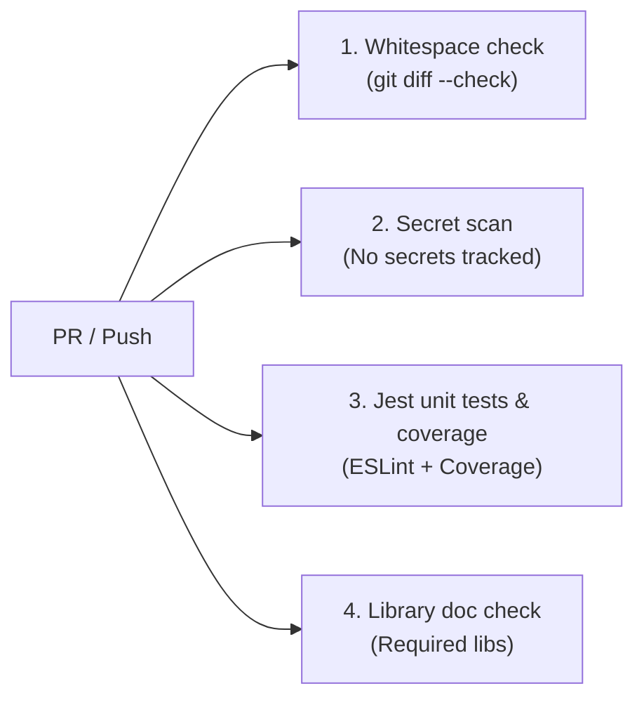

# テスト計画

本ドキュメントは、`esp-bme280-gas-logger` における品質保証方針、CI/CD 自動テストゲート、および実機・運用の検証計画書です。

> [!IMPORTANT]
> **正本仕様書（Single Source of Truth: SSOT）**:
> 詳細なロジック・アルゴリズム・契約の期待値は以下を参照してください。
> - アラート判定・状態遷移: [`docs/specs/alert-state-machine.md`](specs/alert-state-machine.md)
> - LINE Webhook / UI 契約: [`docs/specs/line-webhook-contracts.md`](specs/line-webhook-contracts.md)
> - データ集計・アーカイブ: [`docs/specs/data-lifecycle-and-aggregation.md`](specs/data-lifecycle-and-aggregation.md)

---

## 1. 全体方針

検証は以下の順番で実施します。
1. **CI / 自動テスト検証（コード管理・セキュリティ・単体テスト）**
2. **GAS API 単体テスト（受信・重複排除・集計・通知・アーカイブ）**
3. **ESP8266 ファームウェア単体テスト（基本動作・通信安定化）**
4. **実機統合テスト**
5. **運用・集計・通知機能テスト（GAS/LINE連携）**
6. **本番・長期運用確認**

### 検証優先順位
1. GAS API が正常データを受理し、不正データを拒否する
2. ファームウェアが目的の ESP8266 ボード設定でコンパイルできる
3. デバイスが BME280 データを読み取り 115200 baud で出力する
4. HTTPS POST が期待するステータスと応答を返す
5. スプレッドシートに正しい単位・Tokyo 時刻で行が追加される（重複排除が働く）
6. デバイスが deep sleep 後に正しく復帰する

※ 実機テストおよび GAS の本番デプロイは、人間が手動で確認を行った上で実施します。

---

## 2. CI / 自動テストゲート（GitHub Actions）

Pull Request および `main` ブランチへの push 時に、以下の 4 つの CI ジョブがすべて exit code 0 でパスすることを必須とします。

### 2.1 ゲート基準
1. **Whitespace check**:
   - `git diff --check origin/main HEAD` により、不要な末尾空白や不正な改行コードが存在しないこと。
2. **Secret scan**:
   - `secrets.h` や `.clasp.json` 等の秘密情報ファイルが git 管理されていないこと。
   - `secrets.example.h` にプレースホルダー以外の実値が含まれていないこと。
3. **GAS Jest unit tests & coverage**:
   - **静的解析**: `npm run lint`（ESLint, complexity 閾値: 12）が警告・エラーなしでパスすること。
   - **テスト全件成功**: `npm test` が 100% 成功すること。
   - **カバレッジ閾値**: `npm run test:coverage` が以下の `jest.config.js` 全体閾値を満たすこと:
     - **Branches**: 80% 以上
     - **Functions**: 85% 以上
     - **Lines**: 85% 以上
     - **Statements**: 85% 以上
4. **Library doc check**:
   - ファームウェア README に必須ライブラリ（ArduinoJson, ESP8266WiFi, WiFiClientSecure, ESP8266HTTPClient, Wire）が文書化されていること。

---

## 3. GAS API 単体テスト（Jest 自動テスト）

GAS コードの単体テストおよび各種ロジックテストは、Node.js 20+ と Jest（`tests/*.test.js`）により自動化されています。

### 3.1 リクエスト・レスポンス検証

| ケース | 期待結果 |
| --- | --- |
| 正常な JSON | HTTP 200、`{"ok":true}`、シートに 1 行追加 |
| JSON 不正（`NaN`、`Infinity` を含む） | HTTP 200、`{"ok":false,"error":"invalid_json"}`、行を追加しない |
| 測定値の必須項目欠損 | HTTP 200、`{"ok":false,"error":"invalid_payload"}`、行を追加しない |
| `api_version` または `token` の必須項目欠損 | それぞれ `invalid_api_version` または `invalid_token`、行を追加しない |
| API バージョン不一致 | HTTP 200、`{"ok":false,"error":"invalid_api_version"}`、行を追加しない |
| 不正トークン | HTTP 200、`{"ok":false,"error":"invalid_token"}`、行を追加しない |
| 範囲外の数値 | HTTP 200、`{"ok":false,"error":"invalid_payload"}`、行を追加しない |
| 各測定値の境界値 | 受理され、シートに 1 行追加される |
| `null`、文字列、配列 | `invalid_payload`、行を追加しない |
| 未知の追加フィールド | 追加フィールドを無視して受理される |
| シート追記などのサーバー内部エラー | HTTP 200、`{"ok":false,"error":"internal_error"}` を返せること |
| HTTP 非 200 または JSON 不正の応答 | ESP8266 側で失敗扱いにし、成功扱いにしない |

### 3.2 重複 POST の取り扱い（排除仕様）

通信失敗時の同一測定値再送（最大3回）に対応するため、`RawData` の**最終行のみ**を参照して重複判定を行います。時間窓は **180秒** です。

| ケース | 期待結果 |
| --- | --- |
| 同一値・時間窓内の再送（最終行と一致） | 行を追加せず、`{"ok":true}` を返す（再送ループを終了させる） |
| 同一値だが時間窓を超えた POST | 新規データとして行を追加する |
| 値が異なる POST | 新規データとして行を追加する |
| 最終行が別の測定値の場合 | 新規データとして行を追加する |

---

## 4. ファームウェア単体テスト

### 4.1 基本機能確認
- ESP8266 向け設定でコンパイルできる
- シリアル速度 115200 で起動ログが読める
- BME280 から温度・気圧・湿度を取得できる
- JSON の項目名と単位が API 仕様に一致する
- HTTPS POST のステータスと応答本文を出力する
- 送信後に deep sleep へ移行する

### 4.2 通信・エラーハンドリングの安定化検証
- Wi-Fi 接続に 30 秒タイムアウトがある
- HTTPS POST に 30 秒タイムアウトがある
- 送信失敗時に最大 3 回再試行する（同一測定値）
- Wi-Fi 切断または送信失敗でも無限ループせず deep sleep へ進む
- シリアルログが `[tag] message` 形式で出力される

---

## 5. 実機統合テスト

人間が以下を確認し、結果を `docs/test-results/` へ秘密情報なしで記録します。

- Wi-Fi 接続
- BME280 測定
- GAS への HTTPS POST
- スプレッドシートへの行追加（重複排除が働く）
- Tokyo 時刻の記録
- 5 分後の deep sleep 復帰
- Wi-Fi 切断時のタイムアウト
- GAS エラー時のログ
- BME280 未接続 / I2C 異常時に不正な測定値を送信しない
- Chip ID 不一致時に初期化失敗として deep sleep する
- センサー読取失敗時に GAS 送信をスキップする

※ 通信失敗によるデータ欠損は許容します。永続的なオフラインキューは実装しません。

---

## 6. 運用・集計・通知機能テスト（GAS側）

### 6.1 集計・アーカイブ（`Daily`, `Monthly`, `Raw_YYYYMM`）

| ケース | 期待結果 |
| --- | --- |
| 前日データの集計 | `Daily` に 1 日 1 行追記され、平均・最小・最大が正しい |
| `sample_count` | `anomaly` を除いた有効行数（集計対象）と一致する |
| 異常値行 | `anomaly` 行は平均・最小・最大・`sample_count` の算定から除外される |
| 複数日連続実行 | `Daily` が破綻なく増える（1日1行） |
| データ件数変動 | 件数が少ない日（欠測）でもエラーにならない |
| 生データ整合性 | `RawData` は書き換えない（追記専用） |
| 月次集計 | 前月の `Daily` を `Monthly` へ 1 行追記され、平均・最小・最大と日数（`days_count`）が正しい |
| 月次アーカイブ | 月次集計成功後に自動連動し、直近2ヶ月以前の生データを `Raw_YYYYMM` へ退避・検証後に安全パージする |

### 6.2 環境監視（多層防御アラート制御）

| ケース | 期待結果 |
| --- | --- |
| 閾値超過 1回目 | 平滑化（K=2）待機のため通知しない（`AlertPending`） |
| 閾値超過 2回連続 | LINE 通知が 1 回送られる（`Alerting`） |
| 超過継続（60分以内） | 1時間クールダウンにより再通知を抑制（`cooldown_active`） |
| 60分経過後も超過継続 | 当日送信上限（5回）未満であれば再通知される |
| 1日最大送信数到達 | 当日 5 回到達後は通知を完全停止（`daily_limit_reached`） |
| スヌーズ中（有効期限前） | 通知が完全抑制される（`snooze_active`） |
| 正常復帰（ヒステリシス） | 状態が正常に戻る（**復帰通知は送信しない**） |
| センサー異常値ガード | `-10℃〜50℃`, `0%〜100%` 外の数値は通知対象外（`sensor_anomaly`） |
| 各条件の独立評価 | 気温・湿度・簡易暑さ指数のいずれか超過で通知対象（OR条件） |
| 異常値（急変） | `flag` 列に `anomaly` を記録し、値は保存する（集計から除外） |

### 6.3 LINE Bot インタラクション

| ケース | 期待結果 |
| --- | --- |
| 署名検証（`X-Line-Signature`） | 無効なシグネチャは拒否される |
| 「NOW / 状況 / status」 | 現在値/不快指数/気圧差分/監視状態の Flex Message カードが返る |
| 「SNOOZE / スキップ / skip」 | 翌朝 08:00 JST まで監視停止（SNOOZE設定完了カード返信） |
| SNOOZE カード日時指定 | `datetimepicker` により指定した未来日時までスヌーズされる |
| 「TRENDS / グラフ / 24h / 推移」 | 直近24hの温湿度折れ線グラフ画像（QuickChart URL < 2,000文字）が返る |
| 「TRENDS」データ不足時 | 「グラフを生成するためのデータが不足しています。」テキスト返信 |
| 「CLEAR / クリア / 解除」 | スヌーズ解除＆監視状態リセットメッセージが返る |
| 不明コマンド / ヘルプ | コマンド一覧（NOW/SNOOZE/TRENDS/CLEAR）の案内が返る |
| 処理中例外発生時 | 「⚠️ GAS処理エラー: {詳細}」のフォールバック返信が行われる |
| 応答時間 | Webhook 応答が 2 秒以内（実測で確認） |

### 6.4 センサー未受信ウォッチドッグ

| ケース | 期待結果 |
| --- | --- |
| 未受信（しきい値 `WATCHDOG_TIMEOUT_MIN` 超過） | LINE 通知が 1 回だけ送られる |
| 通知後の継続未受信 | 再通知されない |
| 復帰（`RawData` 追記再開） | 状態がリセットされる |
| 再び未受信 | 復帰後に再度 1 回通知される |

---

## 7. 本番・長期運用確認

### 7.1 本番稼働時の確認項目

| 項目 | 確認内容 |
| --- | --- |
| データ送信 | 実機から送信し `RawData` に保存される |
| 重複送信 | 重複は排除され破綻しない |
| 欠損 | 許容範囲内であること（`sample_count` で把握） |
| 日次処理 | `Daily` シートが更新される |
| 通知 | 条件超過で 1 回通知され、抑制/再通知が機能する |
| エラー | GAS/LINE エラー時に原因追跡が可能 |
| 容量 | Spreadsheet 容量/実行時間が運用範囲内（月次アーカイブが機能） |

### 7.2 長期運用確認のタイムライン
- リリース後 1 時間: データ欠損/トリガー実行/通知の初動確認
- リリース後 1 日: 日次処理/通知抑制の経日確認
- リリース後 1 週間: 容量/実行時間/エラー率の安定性確認
